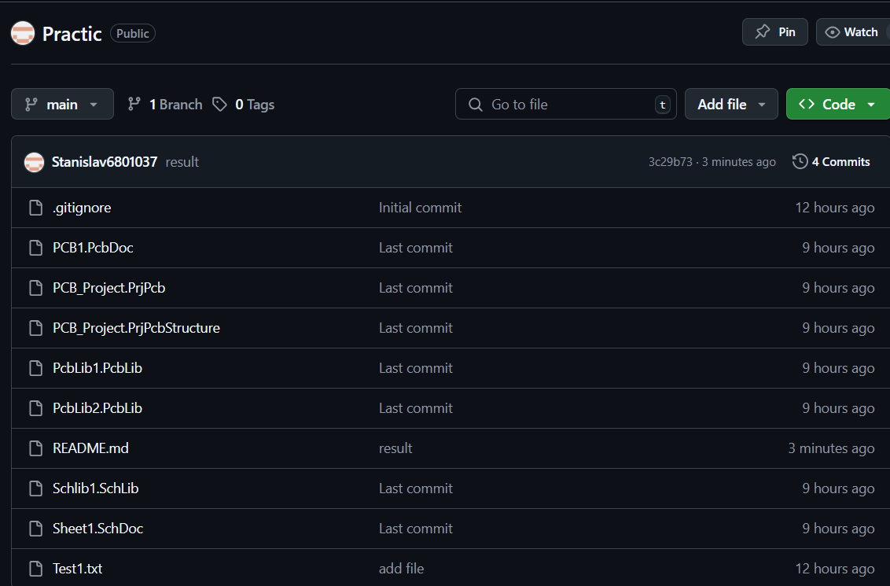
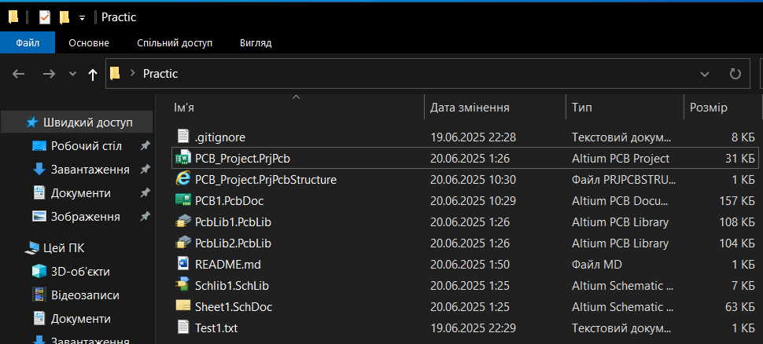
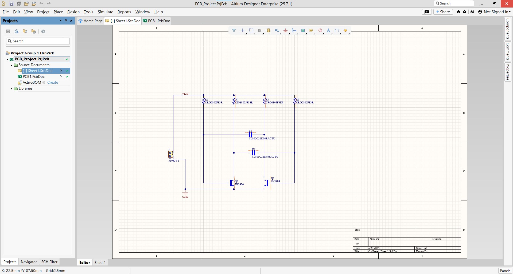
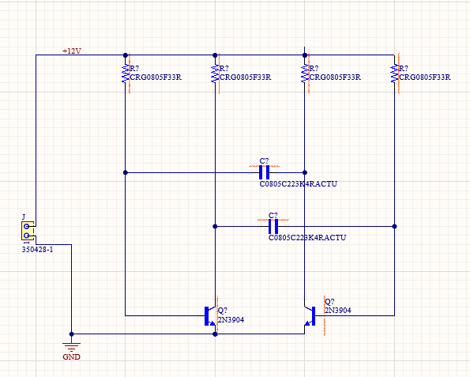
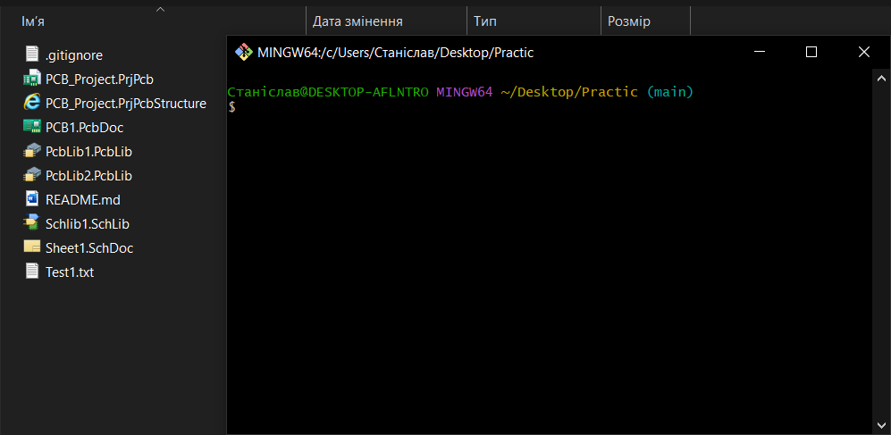

# Цифрова інструментальна практика
Виконав студент Бст-171-24-1ЕС Слюсар Станіслав Юрійович

Цей репозиторій містить матеріали з цифрової інструментальної практики, основним завданням якої була розробка проєкту в програмному середовищі **Altium Designer** з використанням системи контролю версій **Git**.

---

## Етап 1: Створення репозиторію на GitHub

На першому етапі був створений віддалений репозиторій на GitHub, що слугуватиме централізованим сховищем проєкту.

---

## Етап 2: Створення локального репозиторію

Наступним кроком було створення локального репозиторію на комп'ютері для подальшої синхронізації з GitHub.

---

## Етап 3: Завантаження та ознайомлення з програмою Altium Designer

На цьому етапі було встановлено програму **Altium Designer** та здійснено ознайомлення з її інтерфейсом і основними інструментами.

---

## Етап 4: Розробка проєкту в Altium Designer

У середовищі **Altium Designer** розпочато розробку електронної схеми – мультивібратора. Створено схему, розміщено компоненти та виконано трасування.

---

## Етап 5: Контроль проєкту за допомогою Git

Для контролю версій використовувалась система Git. Фіксувались зміни, створювались коміти, виконувалась синхронізація з GitHub.

